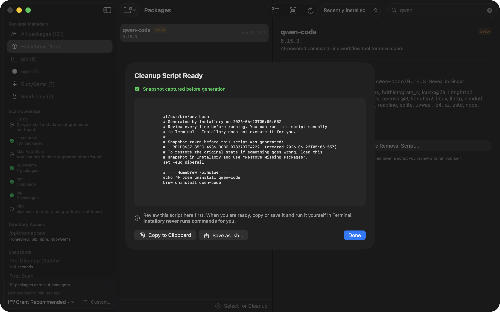

# Installory

**See what's installed on your Mac — and understand how it got there.**

[Download on the Mac App Store](https://apps.apple.com/us/app/installory/id6772879429?mt=12) · [installory.app](https://installory.app/) · Free · MIT licensed · macOS 14+

Installory is a native macOS app that scans your machine for software installed by developer package managers (Homebrew, pip, pipx, npm, Cargo, RubyGems, and Mac App Store apps) and turns the result into something you can actually understand: a clean inventory of every package, what each one is, when it arrived, and how it got there.

It's built for people — especially those working with AI coding tools like Claude Code and Cursor — who've accumulated piles of packages they don't remember installing and don't fully understand. The terminal is intimidating; `brew list` is a wall of names with no context. Installory makes the invisible visible, and makes cleanup safe.

**Why a GUI and not just `brew list`?** Because the value isn't the list — it's the context across managers. One window unifies six package managers plus Mac App Store receipts, adds a plain-language description of what each package is, tells you *why* it's there (provenance), flags cross-manager duplicates, and generates a reviewable removal script you run yourself. It is read-only and makes no network connections. The whole point is to make the system legible without changing it.

## What it does

**Unified inventory.** One window showing every package across Homebrew, pip, pipx, npm, Cargo, RubyGems, and Mac App Store apps — name, version, install location, dependencies, and a plain-language description of what each package actually is.

**Provenance _(opt-in)_.** Cross-references your shell history and Claude Code session logs — behind an explicit consent toggle in Settings → Privacy — to answer the question package managers never do: *why is this here?* Everything stays on your Mac; nothing is sent anywhere. Enable it to see plain-language install traces in each package's detail view, and to filter to packages installed during an AI coding session.

**Duplicate analysis.** Cross-manager duplicates (e.g. `node` in both Homebrew and npm) are classified by severity: *active conflict* (two versions fighting over `$PATH` with a clear winner and shadowed losers), *potential conflict*, or *benign*. Same-manager multi-location installs (the same pip package across multiple Python interpreters) are surfaced separately as informational context.

**Orphan detection.** "Review Candidates" lists explicitly-installed packages that nothing else in your inventory depends on — the lowest-risk first candidates to review for removal. System essentials are excluded.

**Cleanup signals.** Sort the package list by largest, oldest, or combined cleanup score. Each row shows size and estimated install age so you can triage at a glance.

**Safe removal.** When you want to clean up, Installory helps — but it **never deletes anything itself.** It generates the exact uninstall command or a reviewable shell script, which you run yourself in your terminal. You stay in control; nothing is destructive without your hand on it.

**Snapshots and timeline.** Before generating a removal script, Installory saves a snapshot. If a removal causes a problem, you can generate a reinstall script from that snapshot. The Changes tab on any snapshot shows what was added, removed, or version-bumped since that point — turning snapshots from a recovery tool into an ongoing awareness tool.

**Environment report.** Export a shareable Markdown summary — per-manager counts, duplicate groups, orphan candidates, and the full inventory table — sized for pasting into an AI assistant or forum post.

## Screenshots

**The main window** — a unified, three-pane inventory across every supported manager, with a Scan Coverage section that surfaces exactly what was checked and what was skipped:


**Cleanup, the safe way** — Installory captures a snapshot before generating a removal script. The script stays on screen for you to review; you copy it into Terminal yourself when you're ready:



## Design principles

- **Read-only and sandboxed.** Installory inspects your system; it never modifies it. The app is fully App Store sandboxed with read-only, user-granted folder access.
- **No network.** Installory makes no network connections. It collects nothing, sends nothing. Package descriptions are bundled with the app.
- **You run the commands.** Installory generates scripts and commands. It never executes them. Removal always happens in your terminal, under your review.

## Project status

Installory is **live on the Mac App Store** and free. The core scanning/provenance/script-generation library has 421 passing tests. Issues and pull requests are welcome — I'm still fairly new to this, so feedback on which package managers or workflows to support next is especially appreciated.

## Building

**Prerequisites**

- macOS 14 (Sonoma) or later
- Xcode 16 or later
- [XcodeGen](https://github.com/yonaskolb/XcodeGen) — `brew install xcodegen`

**Steps**

```bash
./scripts/regenerate-xcode.sh   # generates Installory.xcodeproj from project.yml
open Installory.xcodeproj
```

In Xcode: select the Installory target → Signing & Capabilities → set your Development Team, then press ⌘R.

> `Installory.xcodeproj` is gitignored intentionally — `project.yml` is the source of truth. Regenerate the project any time you pull changes that touch project structure or add new source files.

## Running the library tests

`InstalloryCore` — the package-scanning, provenance, and script-generation engine — is a standalone Swift package with its own test suite. It runs without Xcode:

```bash
cd Installory
swift test
```

## Architecture

Installory is split into a pure Swift library and a thin app shell:

- **`InstalloryCore`** — all the real logic: package scanners, provenance collection, snapshot management, script generation. No UI, no AppKit, fully unit-tested. This is where the 421 tests live.
- **App layer (`App/Sources/`)** — the SwiftUI interface and the coordinator that wires the library to the screen.

The library is deliberately UI-free so it can be tested in isolation and reasoned about independently of the interface.

## Repo layout

```
project.yml              XcodeGen source of truth for the Xcode project
Installory/              Swift package — the InstalloryCore library + tests
App/
├── Sources/             App-layer SwiftUI sources
├── Resources/           Assets.xcassets (app icon, bundled descriptions)
├── Installory.entitlements
└── Info.plist
scripts/
├── regenerate-xcode.sh          regenerates the Xcode project from project.yml
└── generate-descriptions/       build-time tool that builds the bundled
                                 package-description corpus
files/
└── screenshots/                 README screenshots
```

## License

MIT — see [LICENSE](LICENSE). Free to use, modify, and distribute.
