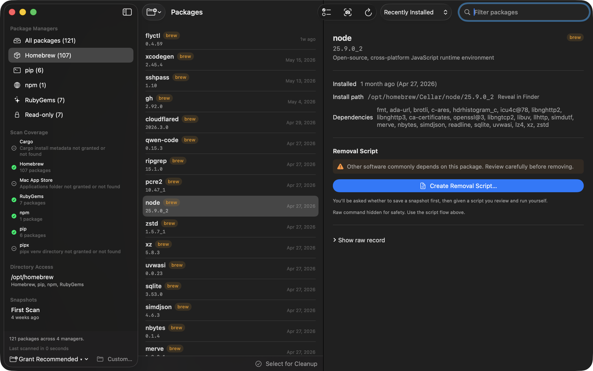
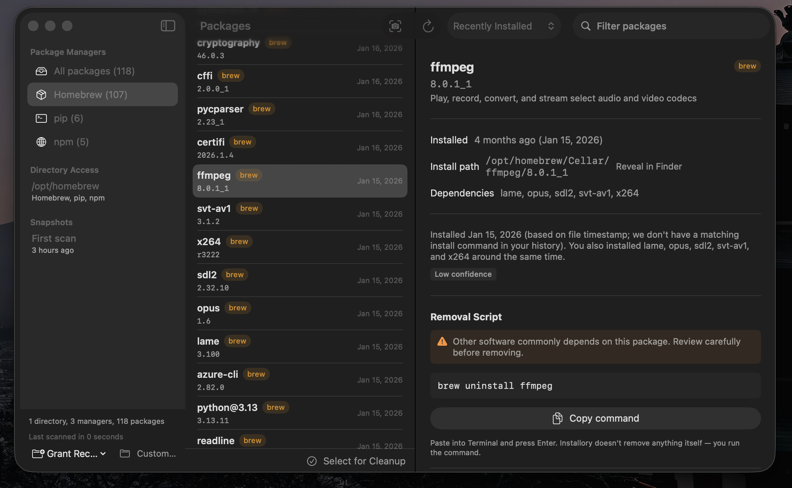

# Installory

**See what's installed on your Mac — and understand how it got there.**

[Download on the Mac App Store](https://apps.apple.com/us/app/installory/id6772879429?mt=12) · [installory.app](https://installory.app/) · Free · MIT licensed · macOS 14+

Installory is a native macOS app that scans your machine for software installed by developer package managers (Homebrew, pip, pipx, npm, Cargo, RubyGems, and Mac App Store apps) and turns the result into something you can actually understand: a clean inventory of every package, what each one is, when it arrived, and how it got there.

It's built for people — especially those working with AI coding tools like Claude Code and Cursor — who've accumulated piles of packages they don't remember installing and don't fully understand. The terminal is intimidating; `brew list` is a wall of names with no context. Installory makes the invisible visible, and makes cleanup safe.

**Why a GUI and not just `brew list`?** Because the value isn't the list — it's the context across managers. One window unifies six package managers plus Mac App Store receipts, adds a plain-language description of what each package is, tells you *why* it's there (provenance), flags cross-manager duplicates, and generates a reviewable removal script you run yourself. It is read-only and makes no network connections. The whole point is to make the system legible without changing it.

## What it does

**Unified inventory.** One window showing every package across Homebrew, pip, pipx, npm, Cargo, RubyGems, and Mac App Store apps — name, version, install location, dependencies, and a plain-language description of what each package actually is.

**Provenance _(in development)_.** A future release will cross-reference your shell history and Claude Code logs — behind an explicit per-source consent toggle — to answer the question package managers never do: *why is this here?* The collectors and tests already live in the codebase under `InstalloryCore/Provenance`; the v1.x app deliberately keeps the feature off until the consent UI ships.

**Safe removal.** When you want to clean up, Installory helps — but it **never deletes anything itself.** It generates the exact uninstall command or a reviewable shell script, which you run yourself in your terminal. You stay in control; nothing is destructive without your hand on it.

**Snapshots.** Before generating a removal script, Installory can save a snapshot of what was installed. If a removal causes a problem, you can generate a reinstall script from that snapshot and put things back.

**Duplicate detection.** Installory flags tools installed by more than one package manager — the classic cause of "why am I running the wrong version?" — so you can resolve the conflict.

## Screenshots

**The main window** — a unified, three-pane inventory of everything installed across the supported managers:



**Package detail** — a plain-language description, install metadata, and a safe removal flow that generates a command for you to run yourself:



## Design principles

- **Read-only and sandboxed.** Installory inspects your system; it never modifies it. The app is fully App Store sandboxed with read-only, user-granted folder access.
- **No network.** Installory makes no network connections. It collects nothing, sends nothing. Package descriptions are bundled with the app.
- **You run the commands.** Installory generates scripts and commands. It never executes them. Removal always happens in your terminal, under your review.

## Project status

Installory is **live on the Mac App Store** and free. The core scanning/provenance/script-generation library has 336 passing tests. Issues and pull requests are welcome — I'm still fairly new to this, so feedback on which package managers or workflows to support next is especially appreciated.

## Building

**Prerequisites**

- macOS 14 (Sonoma) or later
- Xcode 16 or later
- [XcodeGen](https://github.com/yonaskolb/XcodeGen) — `brew install xcodegen`

**Steps**

```bash
./scripts/regenerate-xcode.sh   # generates Installory.xcodeproj from project.yml
open Installory.xcodeproj
```

In Xcode: select the Installory target → Signing & Capabilities → set your Development Team, then press ⌘R.

> `Installory.xcodeproj` is gitignored intentionally — `project.yml` is the source of truth. Regenerate the project any time you pull changes that touch project structure or add new source files.

## Running the library tests

`InstalloryCore` — the package-scanning, provenance, and script-generation engine — is a standalone Swift package with its own test suite. It runs without Xcode:

```bash
cd Installory
swift test
```

## Architecture

Installory is split into a pure Swift library and a thin app shell:

- **`InstalloryCore`** — all the real logic: package scanners, provenance collection, snapshot management, script generation. No UI, no AppKit, fully unit-tested. This is where the 336 tests live.
- **App layer (`App/Sources/`)** — the SwiftUI interface and the coordinator that wires the library to the screen.

The library is deliberately UI-free so it can be tested in isolation and reasoned about independently of the interface.

## Repo layout

```
project.yml              XcodeGen source of truth for the Xcode project
Installory/              Swift package — the InstalloryCore library + tests
App/
├── Sources/             App-layer SwiftUI sources
├── Resources/           Assets.xcassets (app icon, bundled descriptions)
├── Installory.entitlements
└── Info.plist
scripts/
├── regenerate-xcode.sh          regenerates the Xcode project from project.yml
└── generate-descriptions/       build-time tool that builds the bundled
                                 package-description corpus
files/
└── screenshots/                 README screenshots
```

## License

MIT — see [LICENSE](LICENSE). Free to use, modify, and distribute.
