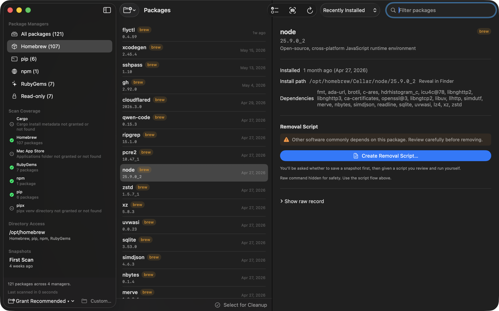
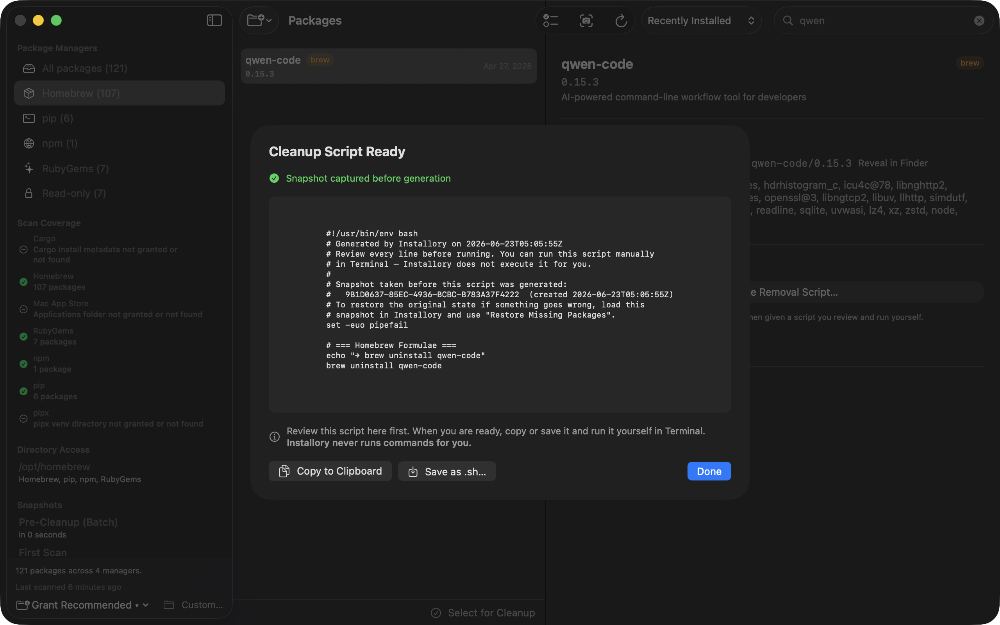

# Installory

**See what is installed on your Mac—and understand how it got there.**

[Mac App Store](https://apps.apple.com/us/app/installory/id6772879429?mt=12) ·
[installory.app](https://installory.app/) · Free · MIT · macOS 14+

Installory is a native macOS inventory for Homebrew, pip, pipx, persistent uv
tools, npm, Cargo, RubyGems, and receipt-bearing Mac App Store apps. It combines
on-disk package metadata into one explained view without modifying the system or
contacting a server.



## Capabilities

- Unified List and sortable Table views with search by name, scope, or path.
- Package descriptions, install timing, dependencies, and bounded payload sizes
  when that metadata is available.
- Cross-manager duplicate analysis, review candidates, cleanup scoring, and a
  measured-payload Disk Usage view.
- Optional local provenance from matching shell history and Claude Code session
  records, enabled explicitly in Settings → Privacy.
- Snapshots, change timelines, and CSV, Markdown, JSON, and environment-report
  exports.
- Exact single or bulk cleanup scripts for the user to review and run manually.
  Bulk cleanup snapshots first; single-package generation follows the selected
  Always, Ask, or Never snapshot preference.



## Safety guarantees

- **Read-only scanning:** Installory never installs, removes, or changes software.
- **No command execution:** production code contains no subprocess calls.
- **No runtime network:** package descriptions are bundled with the app.
- **Sandboxed access:** external folders require user-granted, read-only,
  security-scoped bookmarks. Read-write access applies only to a destination the
  user selects in a Save panel.
- **Local privacy:** provenance is off by default, redacted before persistence,
  and never leaves the Mac.

CI enforces these boundaries with `scripts/check-invariants.sh`.

## Build and test

Installory runs on macOS 14 or newer. Building requires Xcode 16.3 or newer on a
macOS release supported by that Xcode, plus
[XcodeGen](https://github.com/yonaskolb/XcodeGen):

```bash
brew install xcodegen
./scripts/regenerate-xcode.sh
open Installory.xcodeproj
```

Select a Development Team in Xcode before running the app. The generated
`Installory.xcodeproj` is intentionally ignored; `project.yml` is the source of
truth and must be regenerated after app-target files are added, moved, or
renamed.

Run the Core suite without Xcode:

```bash
cd Installory
swift test
```

Run the app suite without signing:

```bash
./scripts/regenerate-xcode.sh
xcodebuild \
  -project Installory.xcodeproj \
  -scheme Installory \
  -destination 'platform=macOS' \
  CODE_SIGNING_ALLOWED=NO \
  CODE_SIGNING_REQUIRED=NO \
  test
```

The offline description corpus has its own
[maintenance runbook](scripts/generate-descriptions/README.md).

## Structure

- `Installory/` — standalone Swift package containing scanners, models,
  persistence, provenance, snapshots, exports, and script generation.
- `App/Sources/` — SwiftUI shell and `AppCoordinator` integration layer.
- `App/Resources/` — app assets, privacy manifest, legal notices, and bundled
  descriptions.
- `project.yml` — XcodeGen source of truth.
- `.github/workflows/test.yml` — Core, app, Release-build, and invariant gates.

The only package dependency is GRDB, pinned to the 7.10 minor series. New
scanners must remain filesystem-only; managers that require executing a command
are deliberate gaps.

## Release

The current 1.4.0 submission notes and archive checklist are in
[RELEASE.md](RELEASE.md). Historical audits and implementation plans live in Git
history rather than the working tree.

## License

Installory is available under the [MIT License](LICENSE). Bundled dependency and
asset notices are in `App/Resources/ThirdPartyNotices.txt`.
